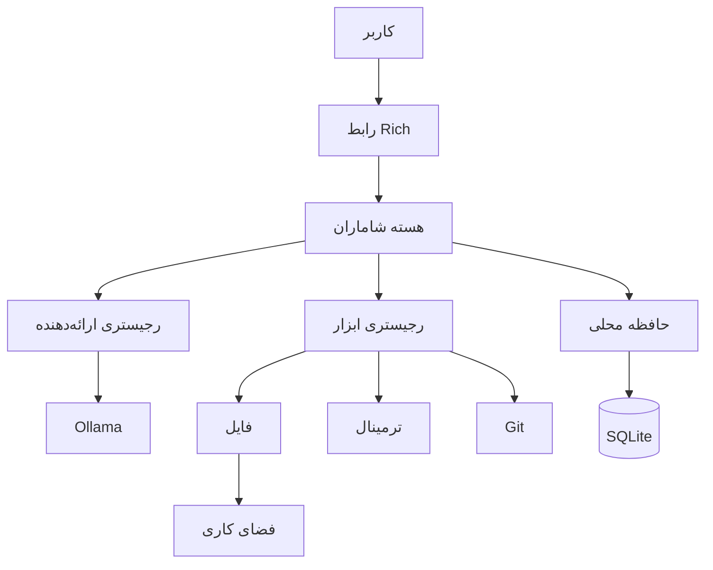

<div dir="rtl">

<p align="center">
  
</p>

<p align="center"><a href="README.md">English</a> · <a href="README.fa.md">فارسی</a></p>

# شاماران

**یک عامل هوش مصنوعی امن و محلی برای رایانه و پروژه‌های شما**

شاماران درخواست‌های طبیعی را به برنامه‌ای کوتاه و فراخوانی ابزارهای کنترل‌شده
تبدیل می‌کند. می‌تواند پروژه‌ها را بررسی کند، در فضای کاری مشخص فایل بسازد،
فرمان‌های محدود ترمینال و عملیات امن Git را اجرا کند و اطلاعات مفید پروژه را در
حافظهٔ محلی SQLite نگه دارد. ارائه‌دهندهٔ پیش‌فرض Ollama است؛ بنابراین می‌توان
پردازش مدل را نیز روی رایانهٔ خودتان نگه داشت.

> **نکتهٔ مهم:** شاماران عمداً یک عامل خودمختار و مهارنشده نیست. تغییرات نیازمند
> تأییدند، فرمان‌های ترمینال از سیاست امنیتی عبور می‌کنند و هر درخواست سقف گام دارد.

## قابلیت‌ها

| قابلیت | توضیح |
| --- | --- |
| محلی‌محور | فایل‌ها، حافظه، گزارش‌ها و استنتاج Ollama می‌توانند روی دستگاه شما بمانند. |
| ابزارمحور | ابزارهای ساختاریافتهٔ فایل، ترمینال و Git فقط نتیجهٔ واقعی را گزارش می‌کنند. |
| امن به‌صورت پیش‌فرض | مرز قطعی فضای کاری، اجرای بدون shell، تأیید تغییرات و سقف گام. |
| حافظهٔ پایدار | تصمیم‌ها و ترجیحات پروژه میان نشست‌ها در SQLite باقی می‌مانند. |
| قابل گسترش | ارائه‌دهنده‌ها و ابزارها از طریق رابط‌ها و رجیستری‌های کوچک جدا شده‌اند. |

## شروع سریع

به Python 3.11 یا جدیدتر، Git و نصب جداگانهٔ Ollama نیاز دارید.

### ویندوز PowerShell

```powershell
git clone https://github.com/YOUR_USERNAME/shamaran.git
cd shamaran
python -m venv .venv
.venv\Scripts\Activate.ps1
pip install -r requirements.txt
Copy-Item .env.example .env
```

### macOS و Linux

```bash
git clone https://github.com/YOUR_USERNAME/shamaran.git
cd shamaran
python3 -m venv .venv
source .venv/bin/activate
pip install -r requirements.txt
cp .env.example .env
```

سپس یک مدل دلخواه را در Ollama نصب و فایل `.env` را تنظیم کنید:

```env
SHAMARAN_PROVIDER=ollama
SHAMARAN_WORKSPACE=./workspace
SHAMARAN_MAX_STEPS=8
OLLAMA_BASE_URL=http://localhost:11434
OLLAMA_MODEL=YOUR_MODEL_NAME
```

شاماران نام مدل خاصی را پیش‌فرض نمی‌گیرد. بعد از راه‌اندازی سرویس Ollama اجرا کنید:

```bash
python scripts/doctor.py
python app.py
```

دو روش دیگر نیز معادل‌اند: `python -m shamaran` و پس از نصب بسته، `shamaran`.

## فرمان‌های داخلی

| فرمان | کاربرد |
| --- | --- |
| `/help` | نمایش راهنما |
| `/status` | وضعیت زمان اجرا |
| `/tools` | فهرست ابزارها |
| `/config` | تنظیمات غیرمحرمانه |
| `/memory` | حافظهٔ اخیر |
| `/memory clear` | پاک‌کردن حافظه با تأیید |
| `/clear` | پاک‌کردن ترمینال |
| `/version` | نمایش نسخه |
| `/doctor` | عیب‌یابی نصب |
| `/exit` | خروج |

## معماری

هستهٔ عامل به Ollama وابستگی مستقیم ندارد. مدل در هر گام یک شیء JSON معتبر برای
اقدام بعدی می‌سازد؛ رجیستری ورودی را اعتبارسنجی می‌کند، ابزار سیاست امنیتی را اعمال
می‌کند و مشاهدهٔ ساختاریافته برای گام بعد بازمی‌گردد. عامل پس از پاسخ نهایی یا رسیدن
به سقف گام متوقف می‌شود.



## امنیت

- نوشتن فایل تنها پس از حل مسیر قطعی و داخل فضای کاری مجاز است.
- عبور با `..`، مسیر مطلق بیرونی و فرار با پیوند نمادین مسدود می‌شود.
- فرمان‌ها با آرایهٔ آرگومان و `shell=False` اجرا می‌شوند؛ زنجیره، pipe، جای‌گذاری
  فرمان و عملیات مخرب پذیرفته نمی‌شوند.
- `git push` اصلاً پیاده‌سازی نشده و `git add` و `git commit` تأیید می‌خواهند.
- حافظه از ذخیرهٔ الگوهای آشکار اعتبارنامه خودداری می‌کند.
- با غیرفعال‌کردن تأیید تغییرات، عملیات حساس به‌طور بسته رد می‌شوند.

اجرای کد یک مخزن ناشناس همچنان می‌تواند خطرناک باشد. پیش از تأیید، منبع و فرمان را
بررسی کنید. جزئیات کامل در [SECURITY.md](SECURITY.md) آمده است.

## توسعه و آزمون

```bash
python -m pip install -e ".[dev]"
python -m pytest
python scripts/check_secrets.py
```

آزمون ارائه‌دهنده‌ها mock شده است و CI به Ollama نیاز ندارد.

## نقشهٔ راه

ایده‌های آینده و **پیاده‌سازی‌نشده** در نسخهٔ 0.1.0: ارائه‌دهنده‌های OpenAI، Anthropic،
Gemini و LM Studio؛ جست‌وجوی اسناد محلی؛ حافظهٔ معنایی؛ رابط دسکتاپ؛ حالت صوتی؛
افزونه‌ها؛ Docker؛ MCP و داشبورد تأیید.

## مجوز

شاماران با [مجوز MIT](LICENSE) منتشر می‌شود.

</div>
