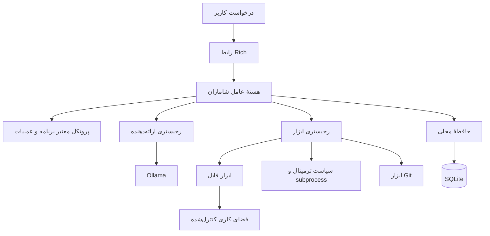

<div dir="rtl">

<p align="center">
  
</p>

<p align="center">
  <a href="README.md">English</a> · <a href="README.fa.md">فارسی</a> · <a href="README.ku.md">کوردی (سۆرانی)</a>
</p>

<p align="center">
  <a href="https://github.com/ashkanWaisi/shamaran/actions/workflows/tests.yml"></a>
  <a href="https://github.com/ashkanWaisi/shamaran/releases"></a>
  
  
  
  <a href="LICENSE"></a>
</p>

<h3 align="center">یک عامل هوش مصنوعی امن و محلی برای کار واقعی روی رایانه</h3>

<p align="center">فکر کن · بساز · به خاطر بسپار · عمل کن</p>

---

## معرفی

شاماران یک عامل هوش مصنوعی خط فرمان و محلی‌محور برای کار با پروژه‌های برنامه‌نویسی،
فایل‌ها، ترمینال، مخزن‌های Git و حافظهٔ پایدار پروژه است. درخواست طبیعی کاربر به یک
برنامهٔ کوتاه و مجموعه‌ای از عملیات کنترل‌شده تبدیل می‌شود. هر ابزار پیش از اجرا
اعتبارسنجی می‌شود و نتیجهٔ واقعی آن برای ادامهٔ کار به هستهٔ عامل بازمی‌گردد.

نسخهٔ فعلی از [Ollama](https://ollama.com/) به‌عنوان ارائه‌دهندهٔ مدل محلی استفاده
می‌کند. هستهٔ شاماران مستقل از Ollama، قابل‌فهم و بدون وابستگی به چارچوب‌های بزرگ
هماهنگ‌سازی عامل‌ها طراحی شده است.

> **مهم:** شاماران یک فرایند خودمختار و بدون نظارت نیست. تغییر فایل‌ها، اجرای
> فرمان‌ها و عملیات Git تحت سیاست‌های مشخص و مرز تأیید کاربر انجام می‌شوند.

## نام شاماران

نام **شاماران** از **شاه‌ماران (Şahmaran)** الهام گرفته شده است؛ چهرهٔ افسانه‌ای
انسان و مار در اسطوره‌شناسی، معنویت، روایت شفاهی، هنر و حافظهٔ فرهنگی کردها. مضمون
دانایی، درمان، حفاظت، طبیعت، مقاومت و پیامد خیانت در روایت‌های او تکرار می‌شود.
پژوهش‌های کردی او را ایزدبانوی مادرِ زمینِ کردستان و بازمانده‌ای از معنویت کهن
کردی توصیف می‌کنند.

نام و هویت پیکسلی رسمی پروژه آشکارا ادای احترام به میراث فرهنگی کردها، مردم
کردستان و نسل‌های کردزبانی است که تصویر و داستان شاماران را زنده نگه داشته‌اند.
برای منابع و توضیح دقیق‌تر، [یادداشت خاستگاه فرهنگی](docs/cultural-origin.md) را
بخوانید.

## چرا شاماران؟

| اصل | پیاده‌سازی |
| --- | --- |
| **محلی‌محور** | استنتاج Ollama، حافظهٔ SQLite، گزارش‌ها و فضای کاری می‌توانند روی رایانهٔ کاربر باقی بمانند. |
| **مبتنی بر نتیجهٔ واقعی** | شاماران تنها زمانی موفقیت یک عملیات را اعلام می‌کند که ابزار نتیجهٔ موفق برگرداند. |
| **امن به‌صورت پیش‌فرض** | کنترل مسیر قطعی، اجرای بدون Shell، محدودیت فرمان، Timeout و تأیید تغییرات. |
| **اجرای محدود** | هر درخواست سقف گام مشخص دارد؛ مقدار پیش‌فرض هشت گام است. |
| **معماری ماژولار** | ارائه‌دهنده، ابزار، حافظه، هستهٔ عامل و رابط کاربری از یکدیگر جدا هستند. |
| **قابل‌فهم** | Python تایپ‌شده و وابستگی‌های محدود، توسعه و بررسی پروژه را ساده نگه می‌دارند. |

## قابلیت‌های نسخهٔ 0.1.0

| بخش | قابلیت فعلی |
| --- | --- |
| عامل | برنامهٔ کوتاه، عملیات JSON معتبر، حلقهٔ مشاهده و سقف گام |
| مدل | ارتباط با Ollama، فهرست مدل‌ها، بررسی سلامت و خطاهای خوانا |
| فایل | فهرست، خواندن، نوشتن، جایگزینی دقیق متن و ساخت پوشه |
| ترمینال | فرمان‌های مجاز، آرایهٔ آرگومان، Timeout، ثبت خروجی و سیاست امنیتی |
| Git | وضعیت، Diff، تاریخچه، شاخه، Add و Commit محلی |
| حافظه | ثبت، جست‌وجو، موارد اخیر، فراموش‌کردن و پاک‌سازی با SQLite |
| رابط | رابط Rich، راهنمای اجرای نخست، Doctor و فرمان‌های داخلی |
| کیفیت | آزمون روی Python 3.11 تا 3.13، Secret Check و GitHub Actions |

### سازگاری

| سیستم‌عامل | Python | اعتبارسنجی خودکار | توضیح |
| --- | --- | --- | --- |
| Windows | 3.11 تا 3.13 | GitHub Actions | راه‌اندازی PowerShell مستند شده است |
| macOS | 3.11 تا 3.13 | GitHub Actions | اجرای نهایی به پشتیبانی Python و Ollama وابسته است |
| Linux | 3.11 تا 3.13 | GitHub Actions | محیط اصلی توسعه و سرور |

هستهٔ پروژه Python خالص است. دسترسی و سرعت مدل به Ollama و مدل انتخابی کاربر وابسته
است؛ سازگاری چندسکویی به معنی تضمین همهٔ مدل‌ها، فرمان‌ها یا تنظیمات سیستم‌عامل نیست.

## شروع سریع

### پیش‌نیازها

- Python 3.11 یا جدیدتر
- Git
- Ollama نصب‌شده و در حال اجرا
- یک مدل دلخواه نصب‌شده در Ollama

### ویندوز PowerShell

کوتاه‌ترین روش نصب سراسری با [uv](https://docs.astral.sh/uv/guides/tools/) است:

```powershell
uv tool install "git+https://github.com/ashkanWaisi/shamaran.git"
shamaran setup --model qwen3.5:9b
shamaran
```

فرمان اول شاماران را مستقیماً از GitHub و در محیطی جدا نصب می‌کند. فرمان `setup`
تنظیمات کاربر را در `~/.shamaran/.env` می‌سازد تا پس از آن، فرمان سادهٔ `shamaran`
از هر پوشه‌ای اجرا شود. برای دریافت نسخه‌های بعدی از `uv tool upgrade shamaran`
استفاده کنید.

برای دریافت سورس و توسعهٔ پروژه:

```powershell
git clone https://github.com/ashkanWaisi/shamaran.git
cd shamaran

python -m venv .venv
.venv\Scripts\Activate.ps1

python -m pip install --upgrade pip
pip install -r requirements.txt
Copy-Item .env.example .env
```

اگر PowerShell فعال‌سازی محیط مجازی را مسدود کرد، بدون تغییر Policy کل سیستم از
Python داخل محیط استفاده کنید:

```powershell
.venv\Scripts\python.exe -m pip install -r requirements.txt
.venv\Scripts\python.exe scripts\doctor.py
.venv\Scripts\python.exe app.py
```

### macOS و Linux

همین فرمان‌های `uv tool install` و `shamaran setup` روی macOS و Linux نیز کار
می‌کنند. برای دریافت سورس و توسعه:

```bash
git clone https://github.com/ashkanWaisi/shamaran.git
cd shamaran

python3 -m venv .venv
source .venv/bin/activate

python -m pip install --upgrade pip
pip install -r requirements.txt
cp .env.example .env
```

فایل `.env` را باز و مدل Ollama را تنظیم کنید:

```env
SHAMARAN_PROVIDER=ollama
SHAMARAN_WORKSPACE=./workspace
SHAMARAN_MAX_STEPS=8
SHAMARAN_LOG_LEVEL=INFO
SHAMARAN_CONFIRM_MUTATIONS=true

OLLAMA_BASE_URL=http://localhost:11434
OLLAMA_MODEL=YOUR_MODEL_NAME
OLLAMA_TIMEOUT=60
```

شاماران عمداً مدل خاصی را پیش‌فرض نمی‌گیرد. نام دقیق مدل نصب‌شده در Ollama را وارد
کنید.

بررسی نصب:

```bash
python scripts/doctor.py
```

اجرای شاماران:

```bash
python app.py
```

روش‌های معادل:

```bash
python -m shamaran
shamaran
```

### مرجع تنظیمات

| تنظیم | مقدار پیش‌فرض | کاربرد |
| --- | --- | --- |
| `SHAMARAN_PROVIDER` | `ollama` | ارائه‌دهندهٔ مدل ثبت‌شده |
| `OLLAMA_BASE_URL` | `http://localhost:11434` | نشانی API اولاما |
| `OLLAMA_MODEL` | ندارد | نام دقیق مدل نصب‌شده؛ الزامی |
| `SHAMARAN_WORKSPACE` | `./workspace` | مرز قابل‌نوشتن فایل‌ها |
| `SHAMARAN_MAX_STEPS` | `8` | سقف سخت گام برای هر درخواست |
| `SHAMARAN_CONFIRM_MUTATIONS` | `true` | تأیید تغییرات پیش از اجرا |
| `SHAMARAN_LOG_LEVEL` | `INFO` | سطح گزارش زمان اجرا |

فایل `.env` را محلی نگه دارید. این فایل در Git نادیده گرفته می‌شود و
`.env.example` الگوی امن آن است.

### رفع اشکال سریع

| نشانه | بررسی |
| --- | --- |
| مدل تنظیم نشده | `ollama list` را اجرا و نام دقیق را در `OLLAMA_MODEL` وارد کنید |
| Ollama در دسترس نیست | Ollama و مقدار `OLLAMA_BASE_URL` را بررسی کنید |
| فرمان `shamaran` پیدا نمی‌شود | محیط مجازی را فعال یا `python -m shamaran` را اجرا کنید |
| تغییر رد می‌شود | پیام تأیید و `SHAMARAN_CONFIRM_MUTATIONS` را بررسی کنید |
| نصب نامشخص است | `python scripts/doctor.py` و [راهنمای پشتیبانی](SUPPORT.md) را اجرا و مطالعه کنید |

## نمونهٔ استفاده

```text
You > inspect this project and run its tests

Shamaran >

Plan
1. Inspect project files
2. Read project configuration
3. Run tests
4. Summarize the result

→ filesystem.list
→ filesystem.read
→ terminal.run

The project tests completed successfully.
```

شاماران برنامهٔ کوتاه و فعالیت ابزارها را نمایش می‌دهد، اما استدلال خصوصی مدل را
نمایش نمی‌دهد.

## فرمان‌های داخلی

| فرمان | کاربرد |
| --- | --- |
| `/help` | نمایش راهنمای تعاملی |
| `/status` | وضعیت اجرا و ارائه‌دهنده |
| `/tools` | فهرست ابزارهای ثبت‌شده |
| `/config` | تنظیمات غیرمحرمانه |
| `/memory` | حافظهٔ محلی اخیر |
| `/memory clear` | پاک‌کردن حافظه پس از تأیید |
| `/clear` | پاک‌کردن نمایش ترمینال |
| `/version` | نمایش نسخهٔ شاماران |
| `/doctor` | عیب‌یابی نصب |
| `/exit` | پایان نشست |

## سازوکار اجرا



1. کاربر هدف را بیان می‌کند.
2. مدل یک برنامهٔ کوتاه یا یک عملیات ساختاریافته برمی‌گرداند.
3. Pydantic نام ابزار و آرگومان‌ها را اعتبارسنجی می‌کند.
4. ابزار سیاست امنیتی فایل، ترمینال یا Git را اعمال می‌کند.
5. عملیات حساس برای تأیید به کاربر نمایش داده می‌شوند.
6. نتیجهٔ ساختاریافته برای گام بعدی بازمی‌گردد.
7. حلقه با پاسخ نهایی یا رسیدن به سقف گام متوقف می‌شود.

## توسعه‌پذیری و اتصال‌ها

شاماران برای اتصال از قراردادهای صریح استفاده می‌کند، نه وعدهٔ غیرواقعی «اتصال به
همه‌چیز»:

- مدل تازه قرارداد `BaseProvider` را پیاده و در رجیستری ثبت می‌کند.
- قابلیت تازه رابط تایپ‌شدهٔ ابزار را پیاده و در `ToolRegistry` ثبت می‌کند.
- حافظهٔ پایدار پشت رابط مستقل حافظه قرار دارد.
- هر تغییر تازه باید پیش از اجرا اعتبارسنجی، سطح امنیت و رفتار تأیید مشخص داشته باشد.

نسخهٔ عمومی فعلی Ollama، فایل، ترمینال، Git و SQLite را پیاده‌سازی کرده است. ارائه‌دهنده‌های
دیگر، MCP، مرورگر، سرویس ابری و کنترل دسکتاپ تا زمان وجود کد و آزمون، برنامهٔ آینده‌اند.

## مدل امنیتی

- مسیرهای نوشتن به‌صورت قطعی حل می‌شوند و با `..`، مسیر مطلق یا Symlink از فضای
  کاری خارج نمی‌شوند.
- بررسی سورس پروژه از محدودهٔ صریح و فقط‌خواندنی استفاده می‌کند.
- فرمان‌ها با آرایهٔ آرگومان و `shell=False` اجرا می‌شوند.
- زنجیرهٔ Shell، Pipe، Redirection، جای‌گذاری فرمان، عملیات مخرب، Git پشتیبانی‌نشده
  و افزایش سطح دسترسی مسدود هستند.
- زمان اجرا و اندازهٔ خروجی ترمینال محدود است.
- تغییر فایل و عملیات Git نیازمند تأیید هستند و بدون امکان تأیید، رد می‌شوند.
- Push، Force Push، Reset Hard، Clean و حذف فایل به‌عنوان ابزار عامل ارائه نشده‌اند.
- حافظهٔ SQLite از ذخیرهٔ الگوهای آشکار اعتبارنامه جلوگیری می‌کند.
- گزارش‌ها انتساب‌های رایج اطلاعات محرمانه را پنهان می‌کنند.

این محافظت‌ها خطر را کاهش می‌دهند، اما اجرای کد ناشناس را بی‌خطر نمی‌کنند. پیش از
اجرای آزمون یا اسکریپت یک مخزن ناشناس، سورس و پیام تأیید را بررسی کنید. جزئیات کامل
در [سیاست امنیتی](SECURITY.md) قرار دارد.

## ساختار پروژه

```text
shamaran/
├── app.py
├── shamaran/
│   ├── agent/          # حلقهٔ محدود برنامه، عملیات و مشاهده
│   ├── providers/      # قرارداد ارائه‌دهنده، رجیستری و Ollama
│   ├── tools/          # مرز فایل، ترمینال و Git
│   ├── memory/         # حافظهٔ محلی SQLite
│   ├── ui/             # رابط ترمینال Rich
│   ├── cli.py
│   ├── config.py
│   └── doctor.py
├── tests/              # آزمون رفتار و امنیت
├── scripts/            # عیب‌یابی و بررسی اطلاعات محرمانه
├── docs/               # مستندات فنی
├── workspace/          # مرز پیش‌فرض نوشتن عامل
├── data/               # پایگاه دادهٔ زمان اجرا، خارج از Git
└── logs/               # گزارش‌های چرخشی، خارج از Git
```

## توسعه و آزمون

```bash
python -m pip install -e ".[dev]"
python -m pytest
python scripts/check_secrets.py
```

آزمون ارائه‌دهنده از HTTP Mock استفاده می‌کند و CI به Ollama در حال اجرا نیاز ندارد.
GitHub Actions مجموعهٔ آزمون را روی Python 3.11، 3.12 و 3.13 اجرا می‌کند.
گردش‌کار CI ویندوز، macOS و Linux را در Jobهای مستقل بررسی می‌کند تا شکست هر محیط
به‌صورت جداگانه دیده شود.

پیش از Pull Request:

```bash
git status
python scripts/check_secrets.py
python -m pytest
git diff --check
```

## وضعیت فعلی پروژه

شاماران `0.1.0` یک MVP اولیه است. گردش‌کار خط فرمان فعلی قابل‌استفاده، آزموده‌شده و
عمداً محافظه‌کار است. موارد زیر در نسخهٔ فعلی وجود ندارند:

- فعالیت خودکار و بدون نظارت در پس‌زمینه
- دسترسی نامحدود به Shell
- Git Push خودکار
- کنترل مرورگر یا دسکتاپ
- حافظهٔ معنایی مبتنی بر Embedding
- رابط گرافیکی دسکتاپ
- تعامل صوتی
- Runtime افزونه یا MCP

نسخه‌های منتشرشده در [Releases](https://github.com/ashkanWaisi/shamaran/releases) و
تغییرات واقعی در [CHANGELOG.md](CHANGELOG.md) ثبت می‌شوند.

## نقشهٔ راه

- ارائه‌دهنده‌های محلی و میزبانی‌شدهٔ بیشتر
- جست‌وجوی اسناد محلی و حافظهٔ معنایی
- پروفایل پروژه و سیاست ابزار قابل‌تنظیم
- مرورگر با تأیید صریح کاربر
- رابط دسکتاپ و تعامل صوتی
- پشتیبانی از افزونه و MCP
- تاریخچهٔ تأیید و داشبورد ممیزی
- بسته‌بندی کانتینری قابل‌بازتولید

موارد نقشهٔ راه برنامهٔ آینده‌اند و قابلیت نسخهٔ فعلی محسوب نمی‌شوند.

## مستندات

- [معماری](docs/architecture.md)
- [راهنمای امنیت](docs/security.md)
- [راهنمای ارائه‌دهنده](docs/providers.md)
- [راهنمای ابزارها](docs/tools.md)
- [نام و خاستگاه فرهنگی](docs/cultural-origin.md)
- [پشتیبانی](SUPPORT.md)
- [مشارکت](CONTRIBUTING.md)
- [آیین رفتار](CODE_OF_CONDUCT.md)
- [تغییرات](CHANGELOG.md)

## هویت بصری

- `docs/assets/shamaran-symbol.png` — نشان مستقل
- `docs/assets/shamaran-logotype.png` — نوشتهٔ شاماران
- `docs/assets/shamaran-lockup.png` — ترکیب نشان و نوشته

نام و هویت بصری شاماران متعلق به پروژه و سازندهٔ آن است.

## سازنده

**شاماران توسط Ashkan Allahveisi ساخته، طراحی و برنامه‌نویسی شده است.**

- GitHub: [@ashkanWaisi](https://github.com/ashkanWaisi)
- گزارش مشکل: [github.com/ashkanWaisi/shamaran/issues](https://github.com/ashkanWaisi/shamaran/issues)

## مجوز

Copyright © 2026 Ashkan Allahveisi

کد منبع تحت [مجوز MIT](LICENSE) منتشر شده است.

</div>
