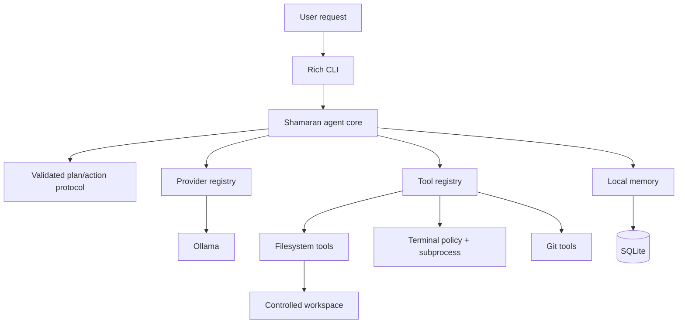
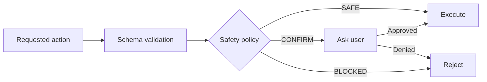

<p align="center">
  
</p>

<p align="center">
  <a href="README.md">English</a> · <a href="README.fa.md">فارسی</a>
</p>

<p align="center">
  <a href="https://github.com/ashkanWaisi/shamaran/actions/workflows/tests.yml"></a>
  <a href="https://github.com/ashkanWaisi/shamaran/releases"></a>
  
  
  
  <a href="LICENSE"></a>
</p>

<h3 align="center">A secure, local-first AI agent for real work on your computer.</h3>

<p align="center">
  Think · Build · Remember · Act
</p>

<p align="center">
  <a href="#why-shamaran">Why Shamaran</a> ·
  <a href="#the-name">The Name</a> ·
  <a href="#quick-start">Quick Start</a> ·
  <a href="#how-it-works">How It Works</a> ·
  <a href="#security-model">Security</a> ·
  <a href="#project-status">Project Status</a>
</p>

---

## Overview

Shamaran is a local-first command-line AI agent designed to work with coding
projects, files, terminal workflows, Git repositories, and persistent project
context. It translates a natural-language request into a concise plan, selects a
registered tool, validates the action, executes it, observes the real result, and
continues until the task is complete or the configured step limit is reached.

The current release uses [Ollama](https://ollama.com/) as its local model provider.
The core remains provider-neutral, small enough to understand, and independent of
large orchestration frameworks.

> [!IMPORTANT]
> Shamaran is a controlled assistant, not an unattended autonomous process. File
> mutations, terminal execution, and Git operations are constrained by explicit
> policies and confirmation boundaries.

## The name

**Shamaran** is inspired by **Şahmaran**, the legendary human-and-serpent figure of
Kurdish mythology, spirituality, oral tradition, art, and cultural memory. Her
stories carry themes of knowledge, healing, protection, nature, resistance, and
betrayal. Kurdish scholarship describes her as the Mother Earth Goddess of
Kurdistan and a surviving expression of pre-Islamic Kurdish spirituality.

The project's name and official pixel identity explicitly honor Kurdish cultural
heritage, the people of Kurdistan, and the generations of Kurdish-speaking families
who have kept the image and story alive. Read the sourced
[cultural note](docs/cultural-origin.md).

## Why Shamaran

Many agent systems hide critical behavior behind a large framework or grant broad
access to the host machine. Shamaran takes a narrower, auditable approach:

| Principle | Implementation |
| --- | --- |
| **Local-first** | Ollama inference, SQLite memory, logs, and workspace data can remain on your computer. |
| **Evidence-driven** | Tool results are structured observations; Shamaran does not claim an action succeeded unless the tool reports success. |
| **Safe by default** | Canonical path checks, `shell=False`, command policies, timeouts, output limits, and mutation confirmations. |
| **Bounded execution** | Every agent run has a configurable hard step limit; the default is eight steps. |
| **Modular** | Providers, tools, memory, agent logic, and terminal presentation are separated behind small interfaces. |
| **Understandable** | Typed Python and minimal dependencies keep the runtime approachable and extensible. |

## Current capabilities

| Area | Included in 0.1.0 |
| --- | --- |
| Agent | Concise plans, validated JSON actions, observation loop, hard step budget |
| Provider | Ollama chat API, model discovery, health checks, readable failure messages |
| Filesystem | List, read, write, exact replace, and directory creation |
| Terminal | Allowlisted commands, argument arrays, timeouts, captured output, policy enforcement |
| Git | Status, diff, log, branch, add, and local commit |
| Memory | Remember, search, recent list, forget, and clear using SQLite |
| Interface | Rich terminal UI, first-run guidance, diagnostics, and built-in commands |
| Operations | Tests on Python 3.11–3.13, secret scan, package metadata, and GitHub Actions |

### Compatibility

| Platform | Python | Automated validation | Notes |
| --- | --- | --- | --- |
| Windows | 3.11–3.13 | GitHub Actions | PowerShell setup instructions included |
| macOS | 3.11–3.13 | GitHub Actions | Intel and Apple Silicon depend on Python/Ollama availability |
| Linux | 3.11–3.13 | GitHub Actions | Primary server and development environment |

The core is pure Python. Provider availability and model performance are determined
by Ollama and the model selected by the user. “Cross-platform” does not mean every
third-party model, shell command, or operating-system configuration is guaranteed.

## Quick start

### Requirements

- Python 3.11 or newer
- Git
- Ollama installed and running
- An Ollama model selected by you

### Windows PowerShell

```powershell
git clone https://github.com/ashkanWaisi/shamaran.git
cd shamaran

python -m venv .venv
.venv\Scripts\Activate.ps1

python -m pip install --upgrade pip
pip install -r requirements.txt
Copy-Item .env.example .env
```

If PowerShell blocks virtual-environment activation, use the environment's Python
directly instead of changing the machine-wide policy:

```powershell
.venv\Scripts\python.exe -m pip install -r requirements.txt
.venv\Scripts\python.exe scripts\doctor.py
.venv\Scripts\python.exe app.py
```

### macOS / Linux

```bash
git clone https://github.com/ashkanWaisi/shamaran.git
cd shamaran

python3 -m venv .venv
source .venv/bin/activate

python -m pip install --upgrade pip
pip install -r requirements.txt
cp .env.example .env
```

### Configure Ollama

Install a model through Ollama, then edit `.env`:

```env
SHAMARAN_PROVIDER=ollama
SHAMARAN_WORKSPACE=./workspace
SHAMARAN_MAX_STEPS=8
SHAMARAN_LOG_LEVEL=INFO
SHAMARAN_CONFIRM_MUTATIONS=true

OLLAMA_BASE_URL=http://localhost:11434
OLLAMA_MODEL=YOUR_MODEL_NAME
OLLAMA_TIMEOUT=60
```

Shamaran intentionally does not hardcode a model. Use the exact name reported by
your Ollama installation.

Run diagnostics:

```bash
python scripts/doctor.py
```

Start Shamaran:

```bash
python app.py
```

The following entry points start the same application:

```bash
python -m shamaran
shamaran
```

The `shamaran` command becomes available after the package is installed.

### Configuration reference

| Setting | Default | Purpose |
| --- | --- | --- |
| `SHAMARAN_PROVIDER` | `ollama` | Registered model provider |
| `OLLAMA_BASE_URL` | `http://localhost:11434` | Ollama API endpoint |
| `OLLAMA_MODEL` | none | Exact installed Ollama model name; required |
| `SHAMARAN_WORKSPACE` | `./workspace` | Writable filesystem boundary |
| `SHAMARAN_MAX_STEPS` | `8` | Hard limit for one agent run |
| `SHAMARAN_CONFIRM_MUTATIONS` | `true` | Require confirmation for mutations |
| `SHAMARAN_LOG_LEVEL` | `INFO` | Runtime log level |

Keep `.env` local. It is ignored by Git; `.env.example` is the safe template.

### Troubleshooting

| Symptom | Check |
| --- | --- |
| No model configured | Run `ollama list`, then copy the exact model name into `OLLAMA_MODEL` |
| Ollama unavailable | Start Ollama and verify `OLLAMA_BASE_URL` |
| `shamaran` command missing | Activate the virtual environment or run `python -m shamaran` |
| A mutation is rejected | Review the confirmation prompt and `SHAMARAN_CONFIRM_MUTATIONS` |
| Installation is unclear | Run `python scripts/doctor.py` and follow [SUPPORT.md](SUPPORT.md) |

## Example session

```text
You > inspect this project and run its tests

Shamaran >

Plan
1. Inspect project files
2. Read project configuration
3. Run tests
4. Summarize the result

→ filesystem.list
→ filesystem.read
→ terminal.run

The project tests completed successfully.
```

Shamaran displays concise plans and tool activity. It does not display private model
reasoning.

## Useful requests

```text
Inspect this Python project and explain its architecture.
Run the tests and explain any failures.
Create a FastAPI starter inside my workspace.
Find TODO comments in this repository.
Show me the current Git diff.
Remember that this project uses PostgreSQL.
Create documentation for this module.
Refactor this file while preserving behavior.
```

Project source is available to filesystem tools through the explicit read-only
`@project/` scope. Normal relative paths refer to the controlled workspace.

## Built-in commands

| Command | Purpose |
| --- | --- |
| `/help` | Show interactive help |
| `/status` | Display runtime and provider status |
| `/tools` | List registered tools and descriptions |
| `/config` | Display non-secret configuration |
| `/memory` | Show recent local memory |
| `/memory clear` | Clear memory after confirmation |
| `/clear` | Clear the terminal display |
| `/version` | Display the Shamaran version |
| `/doctor` | Run installation diagnostics |
| `/exit` | End the session |

## How it works



1. The user states a goal.
2. The provider returns a concise plan or one structured action.
3. Pydantic validates the requested tool and its arguments.
4. The tool applies its own workspace, command, or Git policy.
5. Confirmation-level actions are presented to the user.
6. A structured result is returned to the next agent step.
7. The loop ends with a final answer or the configured step limit.

The application core never depends directly on Ollama. New providers can implement
the same `BaseProvider` contract and register a factory.

## Extending Shamaran

Shamaran is designed to connect through explicit contracts, not an unrestricted
“connect to everything” promise:

- Model backends implement `BaseProvider` and register with the provider registry.
- Capabilities implement the typed tool interface and register with `ToolRegistry`.
- Persistent context is isolated behind the memory interface.
- Every new mutation must define its validation, safety level, and confirmation
  behavior before it can execute.

The current public release includes Ollama plus filesystem, terminal, Git, and
SQLite integrations. Other providers, MCP, browser control, cloud services, and
desktop automation remain roadmap items until code and tests exist for them.

## Security model



Security controls in the current release include:

- Workspace writes are resolved canonically and cannot escape through `..`, absolute
  paths, or existing symlinks.
- Project inspection uses an explicit read-only scope.
- Terminal commands run with argument arrays and `shell=False`.
- Shell chaining, pipes, redirection, command substitution, destructive commands,
  unsupported Git operations, and privilege escalation are blocked.
- Terminal output and execution time are bounded.
- Filesystem and Git mutations require confirmation and fail closed when confirmation
  is unavailable.
- Git push, force-push, reset-hard, clean, and file deletion are not exposed as agent
  tools.
- SQLite memory rejects obvious credential-like content.
- Logs redact common credential assignments.

These safeguards reduce risk but cannot make untrusted code safe to execute. Review
repository code and confirmation prompts before running tests or scripts. See the
complete [security policy](SECURITY.md).

## Project structure

```text
shamaran/
├── app.py
├── shamaran/
│   ├── agent/          # bounded plan, action, observation loop
│   ├── providers/      # provider contract, registry, Ollama
│   ├── tools/          # filesystem, terminal, and Git boundaries
│   ├── memory/         # local SQLite persistence
│   ├── ui/             # Rich terminal presentation
│   ├── cli.py
│   ├── config.py
│   └── doctor.py
├── tests/              # behavior and security regression tests
├── scripts/            # diagnostics and secret scan
├── docs/               # focused technical documentation
├── workspace/          # default writable agent boundary
├── data/               # ignored runtime database
└── logs/               # ignored rotating logs
```

## Development

```bash
python -m pip install -e ".[dev]"
python -m pytest
python scripts/check_secrets.py
```

The provider suite uses HTTP mocks; CI does not require a running Ollama server.
GitHub Actions runs the full suite on Python 3.11, 3.12, and 3.13.
The workflow covers Windows, macOS, and Linux and uses independent jobs so a failure
on one environment remains visible.

Before opening a pull request:

```bash
git status
python scripts/check_secrets.py
python -m pytest
git diff --check
```

Read [CONTRIBUTING.md](CONTRIBUTING.md) before changing a provider, tool, or safety
boundary.

## Project status

Shamaran `0.1.0` is an early MVP. The implemented command-line workflow is functional,
tested, and intentionally conservative. The following are not part of the current
release:

- unattended background operation
- unrestricted shell access
- automatic Git push
- browser or desktop control
- semantic or embedding-based memory
- graphical desktop interface
- voice interaction
- plugin or MCP runtime

See [Releases](https://github.com/ashkanWaisi/shamaran/releases) for published
versions and [CHANGELOG.md](CHANGELOG.md) for implemented changes.

## Roadmap

- Additional local and hosted model providers
- Local document retrieval and semantic memory
- Project profiles and configurable tool policies
- Browser integration with explicit approvals
- Desktop interface and voice interaction
- Plugin and MCP support
- Approval history and audit dashboard
- Reproducible container packaging

Roadmap items are plans, not claims about the current release.

## Documentation

- [Architecture](docs/architecture.md)
- [Security guide](docs/security.md)
- [Provider guide](docs/providers.md)
- [Tool guide](docs/tools.md)
- [Name and cultural origin](docs/cultural-origin.md)
- [Support](SUPPORT.md)
- [Contributing](CONTRIBUTING.md)
- [Code of Conduct](CODE_OF_CONDUCT.md)
- [Changelog](CHANGELOG.md)

## Brand assets

- `docs/assets/shamaran-symbol.png` — standalone symbol
- `docs/assets/shamaran-logotype.png` — wordmark
- `docs/assets/shamaran-lockup.png` — combined mark and wordmark

The Shamaran name and visual identity belong to the project and its creator.

## Author

**Shamaran is created, designed, and developed by Ashkan Allahveisi.**

- GitHub: [@ashkanWaisi](https://github.com/ashkanWaisi)
- Issues: [github.com/ashkanWaisi/shamaran/issues](https://github.com/ashkanWaisi/shamaran/issues)

## License

Copyright © 2026 Ashkan Allahveisi.

The source code is released under the [MIT License](LICENSE).
