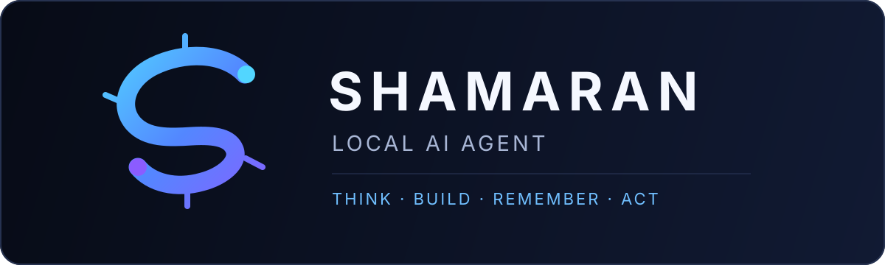
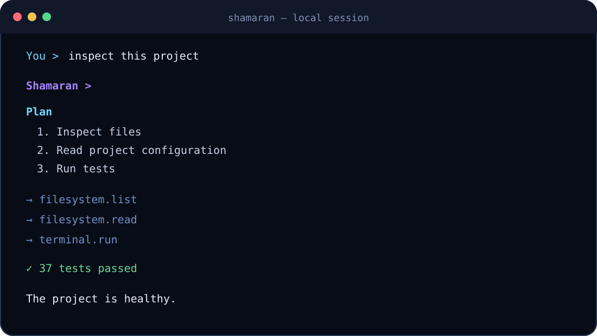
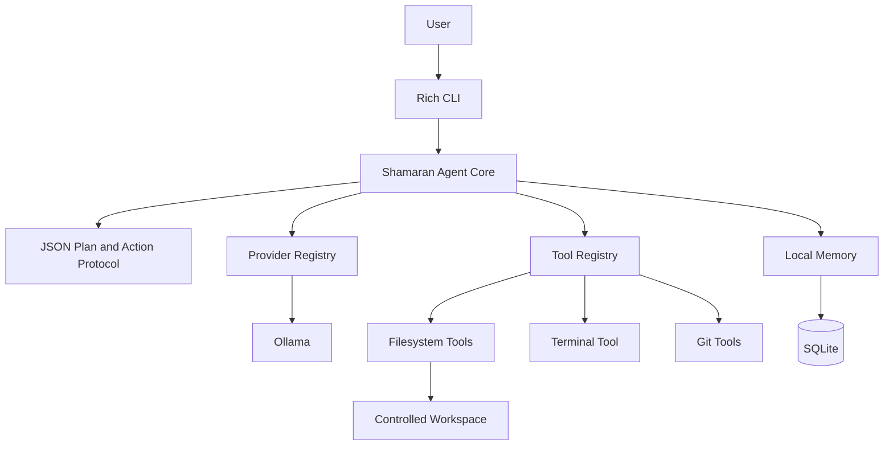
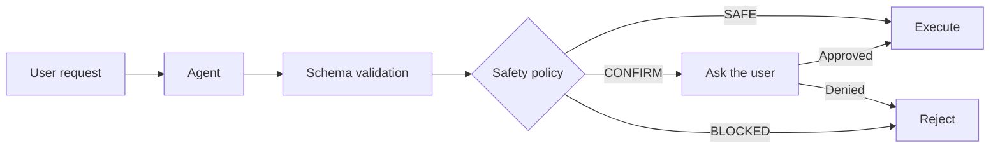

<p align="center">
  
</p>

<p align="center">
  <a href="README.md">English</a> · <a href="README.fa.md">فارسی</a>
</p>

<p align="center">
  
  
  
  
  
</p>

<p align="center"><strong>A secure, local-first AI agent for your computer and projects.</strong></p>

<p align="center">
  <a href="#features">Features</a> · <a href="#quick-start">Quick Start</a> ·
  <a href="#architecture">Architecture</a> · <a href="#security">Security</a> ·
  <a href="#documentation">Documentation</a> · <a href="#roadmap">Roadmap</a>
</p>

Shamaran turns natural-language goals into short plans and controlled tool calls. It
can inspect projects, work inside a dedicated filesystem workspace, run restricted
terminal commands, use safe Git operations, and retain deliberate project context in
local SQLite memory. Ollama is the default provider; model traffic can remain on your
machine.

> [!IMPORTANT]
> Shamaran is intentionally not an uncontrolled autonomous agent. Mutations are
> confirmation-gated, terminal commands are policy checked, and every run has a hard
> step limit.

<p align="center">
  
</p>

## Features

| Capability | What it means |
| --- | --- |
| **Local-first** | Files, memory, logs, and Ollama inference can stay on your computer. |
| **Tool-aware** | Structured filesystem, terminal, and Git tools report real observations. |
| **Safe by default** | Canonical workspace boundaries, shell-free subprocesses, explicit confirmations, and a hard step budget. |
| **Persistent memory** | Project decisions and preferences can survive between sessions in local SQLite. |
| **Provider-neutral core** | Ollama is implemented behind a small interface and registry. |
| **Understandable** | No heavyweight agent framework; the architecture is typed, tested, and deliberately compact. |

## Quick start

### Requirements

- Python 3.11 or newer
- Git
- [Ollama](https://ollama.com/) installed separately, with a model you choose

### Windows PowerShell

```powershell
git clone https://github.com/YOUR_USERNAME/shamaran.git
cd shamaran

python -m venv .venv
.venv\Scripts\Activate.ps1

pip install -r requirements.txt
Copy-Item .env.example .env
```

### macOS / Linux

```bash
git clone https://github.com/YOUR_USERNAME/shamaran.git
cd shamaran

python3 -m venv .venv
source .venv/bin/activate

pip install -r requirements.txt
cp .env.example .env
```

### Configure Ollama

1. Install Ollama separately from its official site.
2. Choose and install a model; Shamaran does not assume one.
3. Ensure the Ollama service is running.
4. Edit `.env`:

```env
SHAMARAN_PROVIDER=ollama
SHAMARAN_WORKSPACE=./workspace
SHAMARAN_MAX_STEPS=8
SHAMARAN_CONFIRM_MUTATIONS=true

OLLAMA_BASE_URL=http://localhost:11434
OLLAMA_MODEL=YOUR_MODEL_NAME
OLLAMA_TIMEOUT=60
```

Diagnose the setup, then start:

```bash
python scripts/doctor.py
python app.py
```

Equivalent entry points are `python -m shamaran` and, after installation, `shamaran`.

## Usage

Try requests such as:

```text
Inspect this Python project and explain its architecture.
Run the tests and explain any failures.
Create a FastAPI project inside my workspace.
Find TODO comments in this repository.
Show me the current Git diff.
Remember that this project uses PostgreSQL.
Create documentation for this module.
Refactor this file but preserve behavior.
```

Project files are readable through the explicit `@project/` tool scope. Filesystem
writes remain confined to the configured workspace.

### Built-in commands

| Command | Purpose |
| --- | --- |
| `/help` | Show help |
| `/status` | Show runtime status |
| `/tools` | List registered tools |
| `/config` | Show non-secret configuration |
| `/memory` | View recent memory |
| `/memory clear` | Clear memory after confirmation |
| `/clear` | Clear the terminal |
| `/version` | Show the Shamaran version |
| `/doctor` | Diagnose the installation |
| `/exit` | Exit Shamaran |

## Architecture



The model proposes one validated action at a time. Shamaran executes it through the
registered tool boundary, sends the structured observation back to the model, and
stops at a final answer or the configured step limit. See
[`docs/architecture.md`](docs/architecture.md) for module responsibilities.

## Security



- Workspace writes use canonical resolution and reject traversal and symlink escape.
- Terminal execution uses `shell=False`, argument arrays, an allowlist, output limits,
  and timeouts.
- Shell chaining, pipes, command substitution, destructive commands, unsupported Git
  operations, and privilege escalation are blocked.
- Git push is not implemented. `git add` and `git commit` require confirmation.
- SQLite memory rejects obvious credentials; logs redact common secret assignments.
- Disabling mutation confirmations makes confirmation-level actions fail closed.

These controls reduce risk, but running repository code can still be dangerous. Review
prompts and source you do not trust. Read the complete [security model](SECURITY.md).

## Project structure

```text
shamaran/
├── app.py                    # direct source entry point
├── shamaran/
│   ├── agent/                # bounded planning and execution loop
│   ├── providers/            # provider contract, registry, Ollama
│   ├── tools/                # filesystem, terminal, and Git boundaries
│   ├── memory/               # local SQLite persistence
│   └── ui/                   # Rich terminal presentation
├── tests/                    # behavior and security regression tests
├── scripts/                  # doctor and secret checker
├── docs/                     # design, security, provider, and tool guides
├── workspace/                # default writable agent boundary
├── data/                     # ignored runtime database
└── logs/                     # ignored rotating logs
```

## Development

```bash
python -m pip install -e ".[dev]"
python -m pytest
python scripts/check_secrets.py
```

Provider tests are mocked; CI does not require Ollama. The included GitHub Actions
workflow tests Python 3.11–3.13.

## Documentation

- [Architecture](docs/architecture.md)
- [Security guide](docs/security.md)
- [Providers](docs/providers.md)
- [Tools](docs/tools.md)
- [Contributing](CONTRIBUTING.md)
- [Changelog](CHANGELOG.md)

## Screenshots

The terminal graphic above is a representative rendering of implemented behavior.
Real platform screenshots will be added as the interface evolves; this project does
not claim unimplemented GUI features.

## Roadmap

Future ideas—not implemented in version 0.1.0:

- OpenAI, Anthropic, Gemini, LM Studio, and OpenAI-compatible providers
- Browser tooling and local document search
- Embeddings and semantic memory
- Desktop GUI and voice mode
- Plugin system, project profiles, and Docker support
- MCP support and an approval dashboard

## License

Shamaran is available under the [MIT License](LICENSE).
